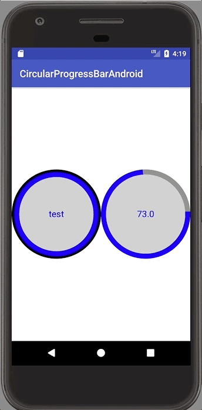

# Circular Progress Bar for Android

Inspired from [lzyzsd/CircleProgress](https://github.com/lzyzsd/CircleProgress)

A circular / Donut Progress Bar for Android written using Kotlin

Now with Rings!



## Getting Started
No other dependencies. 
### Installation

**Step 1:** 
Add this to your root build.gradle at the end of repositories
```groovy
	allprojects {
		repositories {
			...
			maven { url 'https://www.jitpack.io' }
		}
	}
```
**Step 2**
Add the dependency
```groovy
	dependencies {
		compile 'com.github.yadunut:circular-progress-bar-android:0.3.0'
	}
```
## Usage
#### Attributes
```xml
    <declare-styleable name="CircleProgress">
        <attr name="circle_finished_color" format="color"/>
        <attr name="circle_unfinished_color" format="color"/>
        <attr name="circle_inner_color" format="color"/>
        <attr name="circle_ring_color" format="color"/>

        <attr name="circle_finished_width" format="dimension"/>
        <attr name="circle_unfinished_width" format="dimension"/>
        <attr name="circle_ring_width" format="dimension"/>

        <attr name="circle_progress" format="float"/>
        <attr name="circle_progress_max" format="float"/>
        <attr name="circle_start_angle" format="float"/>

        <attr name="circle_show_text" format="boolean"/>
        <attr name="circle_text" format="string"/>
        <attr name="circle_text_color" format="color"/>
        <attr name="circle_text_size" format="dimension"/>
    </declare-styleable>
```

## Acknowledgments

* [lzyzsd/CircleProgress](https://github.com/lzyzsd/CircleProgress)

